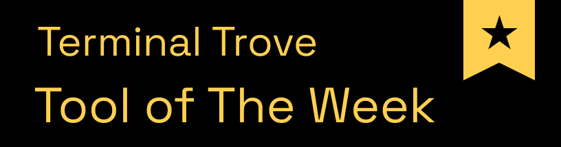

<p align="center">
  <h1 align="center">NetWatch</h1>
  <p align="center">
    <strong>See what your network is actually doing — live, in your terminal.</strong><br>
    <em>A network monitor that reads encrypted traffic, names the process behind every connection, and catches malware calling home. One binary. Zero config.</em>
  </p>
  <p align="center">
    <a href="https://crates.io/crates/netwatch-tui"></a>
    <a href="https://crates.io/crates/netwatch-tui"></a>
    <a href="https://github.com/matthart1983/netwatch/releases"></a>
    <a href="https://repology.org/project/netwatch-tui/versions"></a>
    
    
  </p>
  <p align="center">
    <a title="Tool of The Week on Terminal Trove" href="https://terminaltrove.com/netwatch/"></a>
  </p>
</p>

<p align="center">
  
</p>

<p align="center">
  <em>A quick tour of the live TUI — the dashboard, the program behind every socket, deep packet inspection, the network map, and what each program talks to.</em>
</p>

---

Most network tools answer one question — *"what's using my bandwidth?"* — and stop. NetWatch keeps going. It decodes the protocols on the wire, tells you **which program** opened each connection, and watches for the patterns that mean trouble — a port scan, malware beaconing to a command server, data sneaking out over DNS. When something looks wrong, one keypress freezes a portable evidence bundle you can attach to a bug report.

Think of it as **one zero-config binary that does the job of a bandwidth meter, the triage view of Wireshark, and a lightweight intrusion detector** — without leaving the terminal.

It scales to the question you're asking. `netwatch --lite` is [one 80×24 screen](#lite-view) for *"what's using my network right now?"*; the full ten-tab view is there when the answer is "something I need to investigate" — one keypress apart, sharing the same live capture.

**Made for** blue-teamers, incident responders, SREs, and homelabbers who need to see what's happening *right now* — not parse a capture file an hour later.

<samp>650+ tests · Landlock-sandboxed (Linux) · safely parses hostile traffic</samp>

And the part no other terminal tool does at all: NetWatch learns what each program on the machine talks to, turns that observed baseline into a policy with one keypress, and tells you the moment a program starts talking somewhere new.

<p align="center">
  
</p>

<p align="center">
  <em>Observe → promote → warn. The baseline becomes a policy with one keypress; the next new destination arrives as <strong>drift</strong>.</em>
</p>

## Why NetWatch

- 🔓 **Read encrypted traffic you control** — point a browser or app's `SSLKEYLOGFILE` at NetWatch and watch the plaintext of its TLS 1.3 sessions decode live, the same way Wireshark does it. No proxy, no certificates, nothing in the middle.
- 🛰️ **Learn what every program talks to, then get told when it changes** — NetWatch watches which destinations each process reaches (hostname from the ClientHello, autonomous system, port), and one keypress promotes that observed baseline into an egress policy. From then on it warns when a program starts talking somewhere new. That is the sentence a firewall ruleset cannot express: *`curl` used to reach only `api.github.com`, and today it reached something else.* Observe-only — it never blocks.
- 🧬 **Fingerprint the software behind a connection** — JA4 turns each TLS/QUIC handshake into a stable fingerprint, so you can recognize a specific client — or a specific piece of malware — *even though the traffic is encrypted*, the way you'd recognize a browser by its user-agent. Pivot on a fingerprint to find every other flow from the same software.
- 🚨 **Catch malware calling home** — built-in detection for C2 beaconing (regular, low-jitter check-ins), port scans, and DNS tunneling runs in the background with zero setup. A critical alert auto-freezes the recorder so the evidence is already saved when you look.
- ⚙️ **Name the process behind every connection** — maps each socket to the program that opened it from `ss`/`lsof`, with an optional kernel-level eBPF kprobe (Linux, the `ebpf` feature) that also catches short-lived flows polling can miss. Works everywhere; the kprobe is an enhancement, not a requirement.
- 📡 **Decode the protocols, not just the ports** — real L7 parsing of TLS, QUIC, HTTP, and DNS (plus an SSH banner/version sniff) and a dozen more, with per-flow stream tracking and handshake timing — so you see `api.github.com` and the JA4 fingerprint, not just "port 443."
- 🎥 **Freeze the evidence** — arm a rolling recorder and freeze any incident into a portable bundle: the packets *plus* the connections, DNS, health, and alerts that explain them. Built for bug reports and post-mortems.
- 🛡️ **Safe by design** — after setup, NetWatch drops its privileges and locks itself into a Landlock filesystem allow-list (Linux). A tool that parses hostile traffic *cannot* read your SSH keys, browser profiles, or `/etc/shadow`.
- 🪟 **Scales down to one screen** — `--lite` answers *"what's using my network, and is my connection OK?"* on a single 80×24 screen with six keys, so it fits an SSH session to a Pi or a tmux split. One keypress escalates to the full forensics view with the collectors already warm.

**No config files. No setup. No flags required.**

## Install

```bash
brew install netwatch                 # macOS / Linux
nix-shell -p netwatch                 # NixOS / Nix
paru -S netwatch-tui-bin              # Arch (prebuilt; netwatch-tui builds from source)
scoop install netwatch                # Windows
cargo install netwatch-tui            # anywhere with Rust
```

Or grab a pre-built binary from [Releases](https://github.com/matthart1983/netwatch/releases/latest).

The Nix, Arch and Scoop packages are maintained by community packagers — thank you. File
packaging issues with them; file netwatch bugs here. If a package lags a release, the
[Repology page](https://repology.org/project/netwatch-tui/versions) shows it.

<details>
<summary><strong>All platforms &amp; build-from-source</strong></summary>

| Platform | Download |
|----------|----------|
| Linux (x86_64, Debian/Ubuntu) | [`netwatch-linux-x86_64.tar.gz`](https://github.com/matthart1983/netwatch/releases/latest) |
| Linux (aarch64, Debian/Ubuntu) | [`netwatch-linux-aarch64.tar.gz`](https://github.com/matthart1983/netwatch/releases/latest) |
| Linux (x86_64, static — Arch/Fedora/Alpine/any distro) | [`netwatch-linux-x86_64-static.tar.gz`](https://github.com/matthart1983/netwatch/releases/latest) |
| Linux (aarch64, static — Arch/Fedora/Alpine/any distro) | [`netwatch-linux-aarch64-static.tar.gz`](https://github.com/matthart1983/netwatch/releases/latest) |
| macOS (Intel) | [`netwatch-macos-x86_64.tar.gz`](https://github.com/matthart1983/netwatch/releases/latest) |
| macOS (Apple Silicon) | [`netwatch-macos-aarch64.tar.gz`](https://github.com/matthart1983/netwatch/releases/latest) |

The `-static` Linux builds bundle libpcap and have no runtime dependencies — use these on Arch, Fedora, Alpine, or any distro where the default builds report `libpcap.so.0.8: cannot open shared object file`.

**From source:**

```bash
git clone https://github.com/matthart1983/netwatch.git && cd netwatch
cargo build --release
```

**Prerequisites:** Rust 1.70+, libpcap (`sudo apt install libpcap-dev` on Linux, included on macOS).

</details>

## Quick start

```bash
netwatch            # interface stats, connections, config — no privileges needed
sudo netwatch       # full mode — adds live packet capture + health probes
```

That's it. Switch tabs with `1`–`9`, press `?` for help, `q` to quit. The Dashboard is useful in five seconds; everything below is there when you need to go deeper.

> **Linux without `sudo`:** grant the capture capabilities once and run as your normal user —
> `sudo setcap 'cap_net_raw,cap_bpf,cap_perfmon+eip' "$(which netwatch)"`. Re-run it after every upgrade ([details](docs/REFERENCE.md#running-without-sudo-linux)).

### See it decrypt TLS in 60 seconds

The fastest way to understand what NetWatch is — watch it read the plaintext of a TLS 1.3 session *you* control:

```bash
sudo netwatch                                              # 1. launch, then open the Packets tab (4)
SSLKEYLOGFILE=/tmp/sslkeylog.txt curl https://example.com  # 2. any client that exports its keys
#                                                            3. filter the Packets tab with:  decrypted:true
```

The decrypted application data renders inline. A keylog miss never breaks capture — that record just stays opaque. (`SSLKEYLOGFILE` is the same mechanism Wireshark uses; it only works for traffic *you* control, never third-party or malware traffic.)

<p align="center">
  
</p>

<p align="center">
  <em>Reading the plaintext out of a live <strong>TLS 1.3</strong> session — decrypted right in the terminal. No proxy, no man-in-the-middle.</em>
</p>

### See it catch egress drift in 60 seconds

The loop from the demo above, in three commands:

```bash
sudo netwatch                  # 1. launch and open the Egress tab (0). Leave it a minute
                               #    while it learns; each process grows a list of destinations
                               #    with hostnames, autonomous systems and ports
                               # 2. put the cursor on a process and press Enter — its observed
                               #    baseline becomes a rule in egress-policy.toml
curl https://example.org       # 3. same program, somewhere it has never been
```

The new destination lands with a `✗ drift` verdict and an alert. Nothing was blocked — the point is that you were *told*.

The verdicts are deliberately not a binary:

| | |
|---|---|
| `✓ sni` / `✓ ip` | Matched a declared hostname or address — precise |
| `~ asn` | Matched only by autonomous system — that admits *everything that AS operates*, which for a hyperscaler is effectively unbounded |
| `? ech` | Encrypted ClientHello: the name is hidden by design, so this is "cannot judge", not "bad" |
| `✗ drift` | Outside the allowlist |
| `— no rule` | This program was never declared — nothing was checked |
| `✗ undeclared` | No rule, under `strict = true` — the policy claims to be complete, so the *absence* is the finding |

Rules accept exact hostnames, `*.wildcards`, autonomous systems, CIDR blocks (`10.0.0.0/8`), and ports. `strict = true` is what turns the linter from "tell me when my declared software misbehaves" into "tell me when something I never declared starts talking" — which is the shape an actual compromise has.

## What you get

Ten tabs, switched with `1`–`9` and `0`:

| # | Tab | What it shows |
|---|-----|---------------|
| 1 | **Dashboard** | Interfaces, bandwidth graph, top connections, gateway/DNS health, latency heatmap. Useful in 5 seconds. |
| 2 | **Connections** | Every socket with its process + PID, protocol, state, GeoIP, and latency sparklines. |
| 3 | **Interfaces** | Per-interface IPv4/IPv6, MAC, MTU, RX/TX, errors, drops. |
| 4 | **Packets** | Live capture with real L7 decode, TLS 1.3 decryption, JA4, per-flow stream tracking, filters, PCAP export. |
| 5 | **Stats** | Protocol breakdown by bytes + TCP handshake-timing histogram. |
| 6 | **Topology** | ASCII map of machine → gateway → DNS → top hosts, with traceroute. |
| 7 | **Timeline** | Connection timeline color-coded by TCP state; security alerts land here. |
| 8 | **Processes** | Per-process bandwidth ranking with live RX/TX and connection counts. |
| 9 | **Insights** | *(opt-in)* feeds a snapshot to a local/cloud LLM for plain-language analysis. |
| 0 | **Egress** | Learns what each process talks to (hostname/AS/port), promotes that baseline to a policy with one keypress, then warns on drift. Observe-only, never blocks. |

The Packets tab is where the forensics live — deep protocol decoding, live TLS 1.3 decryption, JA4 threat-hunting, Wireshark-style display filters, and incident capture. **[See the full feature reference →](docs/REFERENCE.md)**

### Lite view

Ten tabs is an operator's instrument. When the question is just *"what's using my network, and is my connection OK?"* — one machine, an SSH session to a Pi, a tmux split — there's `--lite`:

```bash
netwatch --lite     # one screen, fits 80×24
```

<p align="center">
  
</p>

<p align="center">
  <em>One screen, six keys. Live throughput, reachability, and who's talking — expand any row in place, filter as you type.</em>
</p>

Everything on a single screen: live throughput charts, gateway/DNS/internet reachability, and the top talkers by process and host. Six keys — `q` quit, `p` pause, `/` filter, `↵` expand a talker, `L` back to the full view, `?` help.

Press `L` from either view to switch. Both share the same collectors, so escalating from "something looks off" to the full ten-tab forensics view costs one keypress — no restart, no lost history, capture still running.

## Deeper dives

| Guide | What's in it |
|-------|--------------|
| **[Feature reference](docs/REFERENCE.md)** | Every keybinding, the display-filter language, protocol decoder list, themes, and config options. |
| **[TLS 1.3 decryption](docs/REFERENCE.md#tls-13-decryption)** | How `SSLKEYLOGFILE` decryption works, supported cipher suites, and what it can and can't read. |
| **[Threat hunting with JA4](docs/REFERENCE.md#threat-hunting-with-ja4)** | Fingerprinting clients and pivoting across flows. |
| **[Security &amp; the Landlock sandbox](docs/REFERENCE.md#security--forensics)** | The threat model, capability dropping, and the filesystem allow-list. |
| **[Egress policy linting](docs/egress-linter-plan.md)** | The observe → promote → warn model, the rule language, `strict` mode, and the NDJSON export schema. |
| **[Flight Recorder](docs/REFERENCE.md#flight-recorder)** | Arming, freezing, and the contents of an incident bundle. |
| **[AI Insights](docs/INSIGHTS.md)** | Optional local/cloud LLM analysis (off by default). |

## How it works

```
Raw bytes → Ethernet → IPv4/IPv6/ARP → TCP/UDP/ICMP → L7 decoders
                                            ↓
                          Per-flow stream tracking · Handshake timing
                          TLS 1.3 decryption · JA4 · Threat detection
```

| Collector | macOS | Linux |
|-----------|-------|-------|
| Connections | `lsof` + PKTAP | `/proc/net/tcp` + eBPF kprobe |
| Packets | libpcap (BPF) | libpcap |
| Process attribution | PKTAP | `lsof`/`ss` polling, with optional eBPF kprobe overlay |

Everything degrades gracefully: features that need elevated privileges show a clear message and fall back, never crash. Full architecture notes live in [WIKI.md](docs/WIKI.md).

## Related

**Siblings:** [SysWatch](https://github.com/matthart1983/syswatch) (system) and [DiskWatch](https://github.com/matthart1983/diskwatch) (disk) — same chrome, different surface. **[ESSH](https://github.com/matthart1983/essh)** — a pure-Rust SSH client with the same TUI aesthetic; connects where NetWatch observes.

**[NetWatch Cloud](https://www.netwatchlabs.com)** — hosted fleet monitoring for the servers you run NetWatch against. A tiny Rust agent on each Linux host, a real-time dashboard, and email + Slack alerts on latency, packet loss, or hosts going offline. **Free while we grow.** The [agent](https://github.com/matthart1983/netwatch-agent), [SDK](https://github.com/matthart1983/netwatch-sdk), and [dashboard](https://github.com/matthart1983/netwatch-dashboard) are MIT; the hosted backend is proprietary.

## Contributing

Questions, ideas, and bug reports are welcome in [GitHub Discussions](https://github.com/matthart1983/netwatch/discussions) and [Issues](https://github.com/matthart1983/netwatch/issues). See [CONTRIBUTING.md](CONTRIBUTING.md) for coding conventions and [WIKI.md](docs/WIKI.md) for the architecture guide.

## License

MIT
